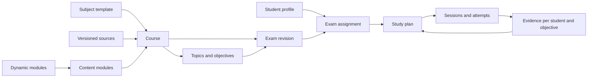

# Subjects, sources, and exams

## A reusable subject framework

Separate the reusable definition of a subject from a particular child's participation in it. A subject template describes how to teach and assess a domain. A course combines that template with a school level, curriculum context, topic map, and sources. An enrolment connects a child to a course; progress belongs to that child.

For example, the mathematics template can support different school years and books. English as a foreign language and English literature can use different course configurations. Science taught in Spanish remains science, with Spanish as the teaching language.

The framework should provide:

- **Metadata:** title, level, curriculum description, teaching language, terminology, and expected notation.
- **Structure:** units, topics, measurable learning objectives, and prerequisite relationships.
- **Content mapping:** which source locations support each objective.
- **Teaching policy:** typical explanations, expected methods, common misconceptions, and hint patterns.
- **Assessment policy:** supported exercise types, marking rules, rubrics, and language expectations.
- **Examples:** reviewed exercises that demonstrate the intended difficulty and style.

Subject templates are starter configurations for assembling courses from versioned content and dynamic modules. Content modules hold the educational data; dynamic modules implement reusable generation, checking and interaction through the Module SDK. External frontier-model agents author both using the [module handoff](modules/README.md). Content editing needs no code; a new dynamic capability can include packaged TypeScript compiled outside Aristotle. Imported code runs only after validation in a restricted runtime, never as privileged subject metadata.

## Curriculum context for this family

The confirmed starting point is ages 12 and 14, the curriculum in England, and Spanish as an additional language. England's secondary key stages cover years 7–9 at KS3 and years 10–11 at KS4. Confirm the children's actual school years and courses instead of assigning these by age. [Department for Education age and key-stage overview](https://getintoteaching.education.gov.uk/life-as-a-teacher/age-groups-and-specialisms/age-groups-you-could-teach).

Provide an England secondary-school starting structure using official subject programmes as references, while letting school materials define the particular exam. [Department for Education secondary curriculum](https://www.gov.uk/government/publications/national-curriculum-in-england-secondary-curriculum).

Course metadata should accommodate academic year, school year, key stage, qualification, exam board, specification code/version, and tier where relevant. These fields can remain unset for an ordinary school test. Do not infer a GCSE board or tier from a textbook title. Keep a school's taught sequence distinct from the broader curriculum map.

Initial subject configurations should cover maths; science with biology, chemistry, and physics topics; English reading, writing, literature, grammar and vocabulary; and Spanish vocabulary, grammar, comprehension, and conversational practice. Science needs dynamic calculations, data interpretation and validated interactive models. Grammar families define supported constructions; vocabulary entries identify word senses, approved contexts and separate recognition/recall/production objectives. Keep optional vocabulary expansion outside the exam scope until deliberately added. Record set texts and teacher marking expectations for English. See [science and language modules](10-science-and-language-modules.md). Longer essay assessment and formal pronunciation/listening assessment need explicit later capabilities; ordinary spoken tutoring is included from the start.

## Domain concepts

| Entity | Meaning and important fields |
| --- | --- |
| StudentProfile | Display name, school level, explanation language, session and gamification preferences |
| SubjectTemplate | Version, domain, supported exercise formats, teaching and assessment policies |
| Course | Template version, title, level, curriculum, teaching language, active source versions |
| Enrolment | Student-to-course link; no shared learning scores |
| Topic / LearningObjective | Topic hierarchy; observable skill; prerequisites; expected difficulty; source mappings |
| Source / SourceVersion | Logical work plus immutable imported edition/file, checksum, language, provenance, extraction status |
| SourceLocation | Exact page/section/span or image region within a source version |
| ContentModule / ModuleVersion | Versioned objectives, explanations, rubrics, assets, source bindings and package digest |
| DynamicModule / ActivityFamily | Exact content dependencies, parameter domain, generator/checker contracts, modes, representations and transfer group |
| ModuleBuildRequest / ImportReport | External-agent handoff, selected exported sources, returned package identity, checks and activation state |
| Exam / ExamRevision | Course, title, date/time zone, scope, exclusions, format, language, methods, and weighting |
| TestBlueprint / TestInstance | Required coverage/formats/marks; frozen generated questions, order, module versions and marking rules |
| ExamAssignment | Student, exam revision, available study time, individual plan and practice settings |
| StudyPlan / StudySession | Scheduled activities, rationale, progress, checkpoint, and active exam revision |
| Conversation / ConversationTurn | Student, course, optional exam revision, active exercise, text or voice modality, confirmed transcript, and reply delivery state |
| Exercise / ExerciseVersion | Objectives, prompt, format, answer/rubric, evidence, difficulty, validation status |
| ActivityInstance / SceneState | Seed, resolved parameters, public prompt/view, private checker data, semantic actions, mode and state revision |
| Attempt / Assessment | Child's response, timing, hints, assessment method, rubric results, review state |
| LearningEvidence | Objective-specific evidence derived from eligible attempts, with provenance and recency |
| StudyMission | Student, exam revision, selected objectives/families, time budget, completion rule and state |
| RewardRule / Award | Host-owned rule/version/category, qualifying event IDs, student binding, earned time and validity; separate from learning evidence |

An exam is the target school assessment. A practice exam is an app-generated rehearsal with its own questions and attempts. They must not be conflated.

The “subject agent” is the shared tutor configured with a course's teaching policy, source access, current exam, and the active student's evidence. It does not require an independent autonomous process for every subject. Voice and text use the same conversation state; raw voice recordings are not retained by default.

Content modules own the objective definitions; dynamic modules reference those IDs rather than creating duplicate skills. Course mappings retain school-specific names and order. Student attempts attach to a frozen activity and module/checker versions, and only host-validated assessment evidence contributes to progress.



## Illustrative TypeScript contract

This is a design sketch, not a final database schema. Identifiers, runtime validation, full rubrics, and storage details will be specified during implementation.

```ts
type LanguageTag = string; // BCP 47, e.g. en-GB or es-ES
type ExerciseKind =
  | "numeric"
  | "multiple-choice"
  | "short-answer"
  | "cloze"
  | "worked-response"
  | "expression"
  | "graph-response"
  | "geometry-response"
  | "quantity-with-unit"
  | "label-selection"
  | "sentence-edit";

// Kinds describe intended formats; each installed family still needs a supported response schema/checker.
type SourceLocator =
  | { kind: "pdf-page"; pageIndex: number; printedLabel?: string }
  | { kind: "text-span"; sectionId: string; start: number; end: number };

interface SourceReference {
  sourceVersionId: string;
  locator: SourceLocator;
}

interface LearningObjective {
  id: string;
  topicId: string;
  description: string;
  prerequisiteIds: string[];
  evidence: SourceReference[];
}

interface ScopeItem {
  objectiveId: string;
  allowedEvidence: SourceReference[];
  importance: "core" | "supporting";
  weight?: number; // Explicit teacher/parent weight, never inferred as fact
}

interface ExamRevision {
  id: string;
  examId: string;
  courseId: string;
  revision: number;
  date: string; // Local calendar date; time and timezone stored if supplied
  assessedLanguage: LanguageTag;
  scope: ScopeItem[];
  excludedObjectiveIds: string[];
  excludedEvidence: SourceReference[];
  formats: ExerciseKind[];
  modulePins: { moduleId: string; version: string; packageDigest: string }[];
  calculator: "allowed" | "not-allowed" | "unspecified";
  status: "draft" | "active" | "archived";
}
```

The resolved scope includes both objective IDs and allowed evidence. Topic names alone cannot express that only part of a chapter is examinable. Source locators will need finer PDF regions/text spans and EPUB anchors as those formats are supported.

## Importing complete books and other sources

Whole books are first-class inputs even when an exam covers only a few pages. Preserve the original file, extract structure once, and reuse it for multiple exams. Importing a book does not mean sending the whole book to a model for every question.

| Input | Initial treatment | Later extension |
| --- | --- | --- |
| Searchable PDF book or worksheet | Import complete file; preserve page order and printed-page mapping; extract text and headings | Better layout and image interpretation |
| Text or Markdown notes; pasted teacher guidance | Preserve headings and stable paragraph locations | Richer document formats |
| Scanned PDF or photos | Detect missing text; show affected pages as unavailable for automated study | OCR with page-level review and corrections |
| EPUB | Planned book format after the PDF workflow; preserve edition and chapter anchors | Rich media |
| Website | Initially accept pasted text with a recorded URL and capture date | Explicit import of a saved snapshot |
| Audio, video, slides, handwriting | Outside the first release | Transcripts, timing anchors, specialist extraction |

If the family's actual books are predominantly scans, OCR becomes a prerequisite to the first usable release rather than an optional later feature. Representative sources must determine that decision.

### Import pipeline

1. Copy the selected file into managed storage; record its original name, checksum, edition details, and import time. Detect duplicates without silently replacing an edition.
2. Validate format and limits before parsing. Run extraction as a cancellable background job and retain progress for restart.
3. Extract page/section text and retain location metadata. Preserve image regions and equations when possible; never silently substitute uncertain OCR as authoritative text.
4. Report readable, partially readable, and unreadable pages. Detect empty extraction, reading-order problems, and formula/diagram-heavy pages for review; do not assume plain-text extraction proves completeness.
5. Propose chapters, topics, objectives, and source mappings. Present these as editable suggestions, including unmatched material.
6. Index the approved content for search and retrieval. Track parser and index versions so rebuilding does not destroy source identity.
7. Allow the parent to confirm that the material selected for an exam is usable. Other unreadable pages need not block an unrelated exam.

A partially imported source is visibly partial. If a selected diagram or equation cannot be interpreted, the system can display the original for study but must mark the corresponding automated exercises or coverage as unavailable.

### Page identity and citations

Store the zero-based PDF page index separately from the printed label. “PDF page 52 / printed page 47” should open the right page even when front matter changes the offset. Support non-numeric labels and irregular numbering; a single global offset is not always enough.

A citation resolves to an immutable source version and location, optionally highlighting a passage. A generated example cites the rule or concept it applies and is labelled as a generated example; it must not be presented as a verbatim textbook exercise.

Teacher notes may narrow the exam or specify a method without containing a full explanation. Distinguish scope instructions from teaching evidence. Conflicting explanations or answer keys should be flagged for parent review; model output cannot silently decide which edition or instruction is authoritative.

## The exam is an explicit contract

Exam setup collects a title, date, scope, exclusions, language, available preparation time, and any known format. Optional fields include topic weighting, duration, calculator policy, formula sheet, expected methods, marking rubric, and teacher-provided examples. Unknowns remain “unspecified”; a proposal must not appear to be a teacher's requirement.

Natural-language input such as “chapter 4 except percentages” produces a draft selection. Activation uses the resolved, reviewable scope, not the raw sentence alone.

### Scope rules

- Multiple included source ranges form a union; explicit exclusions subtract from it.
- When both objectives and source ranges are selected, assessed tasks must match a selected objective **and** be supported within the allowed ranges.
- Topic-only selection resolves to proposed source locations that the parent can inspect. Unmapped objectives remain visible as gaps.
- Exclusions win over inclusions, including when the same concept occurs elsewhere in the book.
- A chunk crossing a page or exclusion boundary must be trimmed or rejected before retrieval reaches the tutor.
- Prerequisite help can refer to separately identified course material, but is labelled as background help and does not expand mock-exam scope or the coverage denominator.
- An unsupported objective cannot be silently removed to improve the readiness display. The parent must add evidence, correct mapping, or explicitly revise scope.
- Installing a module does not add its whole curriculum to an exam. Every selected family, hint and visual must remain within the resolved objective, method, difficulty and source boundaries; background help follows the separate prerequisite rule.
- A test blueprint must be satisfiable by the installed versions and available response/view capabilities. Unsupported formats remain visible even if the underlying text is readable.
- A generated instance cites the supported concept and its module provenance; its generated numbers and graph are not represented as an exercise copied from the book.

### Example

An illustrative exam includes a fractions chapter's printed pages 42–57 and worksheet questions 1–8. Page 55 and questions 7–8 are excluded. Its objectives are equivalent fractions, comparing fractions, and addition with different denominators. Percentages are explicitly excluded.

The review screen must show the resolved pages and questions, their objectives, and any unresolved locations. If the teacher assigned “fractions” but the source mapping only supports equivalent fractions, the remaining objectives stay marked as unsupported. The app must not claim complete coverage.

## Versioning and lifecycle

Changing an active exam's scope creates a new revision and a visible plan update. Completed attempts retain the old revision. Existing evidence may inform a new plan when objectives remain compatible, but coverage is recomputed against the new scope.

Module updates cannot change a running test. Frozen tests retain prompts, parameters, relevant scene state and checker versions as well as seeds. A broken checker can be quarantined, repaired and used for explicit versioned reassessment; prior results are not silently overwritten. Export/import uses module IDs and digests, not paths tied to the external builder's machine.

Correcting a source or exercise creates a new version. Assessments based on a faulty answer key can be withdrawn or revised with a reason; derived progress is recalculated. Editing a label should not needlessly reset learning history, while changing an objective's meaning requires explicit migration.

Archiving preserves history. Deletion follows a separate parent action with a preview of affected sources, generated material, and learning records. Indexes and cached passages must be removed with their source; an old citation can remain as an “unavailable source” record without retaining deleted text.
