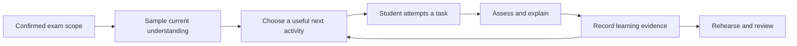

# Tutor and learning design

## The learning loop

The tutor should repeatedly answer four questions: what is in this exam, what evidence do we have about this student's understanding, what should they do next, and what did that activity teach us?

Retrieval practice and spacing provide a research basis for asking students to recall material and returning to it later. A vocabulary experiment found benefits from repeated retrieval, while a separate study of factual learning found that useful spacing depended on the delay to the final test. Neither study validates this application's tutoring, marking, or readiness estimates. [Karpicke and Roediger, 2008](https://learninglab.psych.purdue.edu/downloads/2008/2008_Karpicke_Roediger_Science.pdf), [Cepeda and colleagues, 2008](https://doi.org/10.1111/j.1467-9280.2008.02209.x).

The policies below are product hypotheses to evaluate, not scientifically established constants.

## Study modes

| Mode | Behaviour |
| --- | --- |
| Diagnostic | Short sample across objectives, no hints before the first response; “I don't know” is allowed |
| Learn | Explain a concept, show a worked example if useful, then ask the student to try |
| Explore | Predict, manipulate a validated diagram/graph/3D model, explain the result, then attempt an independent question |
| Practise | Mix question formats and difficulty; offer graduated hints and immediate feedback |
| Review | Revisit previous learning with a fresh prompt after time or intervening work |
| Cram | Prioritise the remaining time, known exam emphasis, weak areas, and unresolved prerequisites |
| Practice exam | Match the configured scope and format; withhold hints and feedback until submission |

The tutor selects installed content and dynamic modules for these modes. External agents build and revise the modules outside the study session. If a required family or representation is missing, the tutor records the gap and uses an appropriate available activity; it cannot pretend to have generated and validated new executable behaviour immediately.

“Explore” is a learn-mode presentation, and “Cram” is a planning policy across supported activity modes; neither introduces an extra runtime mode outside the Module SDK contract.

A child should be able to switch from a difficult practice item to an explanation without being trapped in a hint sequence. A revealed solution is recorded as assisted work; the follow-up uses a different question.

## Anatomy of a session

1. Confirm the exam and available time; resume an interrupted session if appropriate.
2. Explain the session's small goal in ordinary language.
3. Ask a recall or application question before showing its answer, unless introducing unfamiliar material.
4. Capture the typed response or confirmed speech transcript, hint use, and optional self-reported confidence.
5. Assess with the relevant subject rules. Explain the key issue and point to supporting material.
6. Choose a new generated instance, a visual explanation, a prerequisite exercise, or another objective based on the evidence. Follow exploration with a fresh independent response.
7. End with what improved, what remains uncertain, and the next suggested review.

An illustrative 15-minute session might spend two minutes revisiting a prior topic, nine on a current difficulty, three on mixed practice, and one on reflection. Let the 12- and 14-year-old students and their parent adjust this; age alone should not determine session length.

## Planning before an exam

The planner starts from available minutes before the exam, existing attempts, objective coverage, declared importance, and prerequisites. It must explain priorities without presenting an uncalibrated prediction of a future grade.

For a first implementation, use transparent rules:

- Sample objectives with no evidence before repeatedly polishing familiar ones.
- Prioritise core objectives with recent mistakes, especially prerequisite gaps blocking other work.
- Reserve some time for independent mixed practice and a short rehearsal where feasible.
- Revisit successful material in a later session, or after intervening activities when the exam is imminent.
- Respect the total daily study budget across concurrent exams. Missed sessions trigger a smaller revised plan rather than accumulating impossible assignments.
- Ask for a usable schedule when none is known, or present an editable proposal.

**Several days available:** distribute practice and revisit topics on later days. **Exam tomorrow:** focus on core gaps and a short rehearsal, while showing what will remain uncovered. **Only 30 minutes:** offer a small priority set and an honest coverage summary. Do not imply that a compressed plan replaces learning over time.

When there is too little time for the selected scope, explain the tradeoff and let the parent change priorities. The agent may reorder activities within the approved time and scope; expanding scope or increasing the time budget requires an explicit change by the user.

## Subject-specific behaviour

| Domain | Useful activities | Assessment requirements |
| --- | --- | --- |
| Mathematics | Seeded numeric/algebra tests, worked steps, word problems, graphs, geometry and 3D exploration | Exact or tolerance-based checking as declared, units, answer form, permitted methods and partial credit; separate slips from conceptual errors |
| Science | Generated calculations and data questions; predict and explore a bounded model; explain a mechanism or experimental result | Exact quantities and unit rules for supported responses; separate rubrics for causal reasoning; declare model assumptions and synthetic data |
| English | Reading, textual evidence, generated grammar cloze/editing, vocabulary recall and contextual use, structured paragraphs | Reviewed language constraints and accepted variants; sense-specific vocabulary evidence; separate recognition/recall/production and teacher rubrics for open responses |
| Spanish | Vocabulary, conjugation, cloze, comprehension, short written responses | Accents, agreement, tense, regional variants, and the teacher's terminology |

Voice tutoring, spoken recall, conversational Spanish practice and an initial set of diagram/graph/3D activities are first-release capabilities. Each interactive assessment needs an explicit response contract and checker; support for displaying a solid does not imply support for every geometry question. Longer essays, formal pronunciation scoring and exam-standard oral assessment require further rubrics. A transcribed spoken answer is not evidence of correct spelling or pronunciation. See [AI connections and voice](06-ai-connections-and-voice.md).

### Multiple languages

Store interface language, explanation language, source language, and assessed language separately. A child can receive a Spanish explanation of an English grammar task, or an English explanation of science taught in Spanish. Translation support must not silently change the language expected in the answer.

For language subjects, distinguish learning the language from studying literature in that language. Mark content and language separately when the rubric calls for it. Support accents and locale-specific decimal notation explicitly; do not accept a spelling or decimal separator by accident. Any target dialect or curriculum-specific convention is configured at course level.

## Exercise generation and validation

Use validated dynamic-module families to generate bounded batches from the exam's test blueprint. Where appropriate, use reviewed fixed exercises or source-grounded language generation for rubric-based tasks. Store each instance's prompt, parameters, private answer/rubric, module and checker versions, source references, difficulty, hints and assessment contract. Parameter generation and deterministic checking run locally even when no model is available.

Before showing it to a child, validate that:

1. The task belongs to the active exam scope and is supported by usable source evidence.
2. The answer and explanation agree with the source and, where possible, a deterministic calculation or known answer key.
3. The prompt contains enough information, the response format is supported, and distractors do not create multiple valid answers.
4. The language and notation fit the course and student level.
5. It is sufficiently distinct from recent exercises when intended as new evidence.

Schema validation and source-location checks are mechanical gates. Semantic support, ambiguity, and difficulty require quality evaluation; a second model pass is not proof of correctness. Keep failed items out of practice and expose disputed ones to parent review.

Validate families before activation and every generated instance before use. Parents review representative examples and educational fit, not every valid parameter combination. Retain a small reviewed fallback bank. Mock exams are assembled and frozen before starting; adaptive practice chooses the next instance after feedback. Neither questions nor answer keys should exist only in chat history.

## Marking and uncertainty

Use deterministic checks where they fit: exact rational arithmetic, declared numeric tolerances, units, supported symbolic equivalence, graph coordinates and accepted language variants. Use bounded rubrics for open-ended responses, with criterion-level feedback and a provisional label when judgment is uncertain. External agents may author checker code as part of a validated module; fresh code from a tutoring response never becomes an answer checker during the session. See [maths correctness contracts](08-maths-tests-and-visual-learning.md) and [science/language checking and host rubric review](10-science-and-language-modules.md). Module checkers stay deterministic; the host evaluates open responses separately with recorded provenance and uncertainty.

An assessment can be correct, partially correct, incorrect, or unassessed. Ambiguous questions and unsupported responses are unassessed, not automatically wrong. A model's stated confidence alone is not sufficient to turn uncertain marking into reliable evidence.

Students can challenge a result; parents can correct it. Preserve the original assessment and the reason for a revision. Correcting a faulty question invalidates affected evidence and refreshes the plan.

## Evidence of readiness

Maintain evidence per student and objective, not a single opaque subject score. The first release can use simple states:

| State | Proposed interpretation |
| --- | --- |
| Not assessed | No eligible attempts; unknown, not failure |
| Needs support | Recent independent attempts show difficulty, or most successes required help |
| Developing | Some independent success, but little variety or consistency |
| Demonstrated in practice | Repeated independent success on distinct items, including a later check |
| Review due | Useful earlier evidence exists, but the planned review is due |

A starting rule for “Demonstrated in practice” could require three independent successes on distinct items over at least two sessions, including one application question where appropriate. This is deliberately conservative and must be tuned. Immediate repetitions, revealed answers, and uncertain assessments do not satisfy it. Cram sessions may end without reaching this state.

Track activity family, representation, structural variant and transfer group as well as the exact question. Changing only numbers is useful fluency practice but weak evidence of broader transfer. An objective requiring interpretation or a different exam format needs evidence in that format. Dragging, rotating, watching an animation, or successfully following a demonstrated sequence is not independent success by itself.

Show counts and dates underneath the label: “3 of 4 independent attempts correct; last checked yesterday.” Report source coverage, attempted coverage, and demonstrated coverage separately. Unsupported objectives remain in the overall exam scope and appear as gaps.

Confidence self-reports can help start a conversation about uncertainty but do not count as demonstrated understanding. Reading a summary or completing a chat also does not count as successful recall.

Practice exams should reserve unseen items or genuinely different variants where possible. Label reused questions and separate their results. Keep rehearsal scores distinct from predicted school results.

## Optional motivation layer

Study missions present the next useful part of the plan as a manageable challenge. Badges can recognise returning to an objective, working through a mistake or completing rehearsal, using the [gamification rules](11-gamification-and-badges.md). Only validated independent evidence can qualify for a learning milestone; session completion is a different category. Points, badges and time spent never become input evidence for readiness.

Keep hints available without a reward penalty. Missions respect exam scope, remaining time and supported activities. Disable celebrations during mock exams and spoken explanations; each child can turn the motivation layer off. The host evaluates earning rules, while the tutor can explain the resulting milestone.

## Agent boundaries

The agent selects learning activities, proposes plans, generates explanations, and asks follow-up questions through bounded application operations. Application code owns scope rules, time and cost limits, identity, state transitions, and persistence.

Visual teaching follows predict → manipulate → explain → solve independently. The tutor uses declared semantic actions against the current scene revision, not arbitrary UI code. A scientific or mathematical value, grammatical explanation, narration and checker must derive from the same validated state. If they disagree, stop assessment, preserve the answer and mark the activity for review.

The same rules apply during voice conversation. Before marking an ambiguous spoken number, unit, or word, confirm the transcript. Recogniser mistakes remain separate from learning difficulties, and an interrupted or unheard reply does not establish that the student received an explanation.

It must not invent a source citation, quietly expand exam scope, represent unreadable pages as covered, or convert its own explanation into evidence that the child understands. If retrieval fails, it says which material is missing and offers to read an available source or ask the parent for help.

Imported books, notes, and model responses are untrusted content. Instructions embedded in a document cannot change the agent's permissions or request access to other profiles or files. Student content should remain age-appropriate; when uncertain, the tutor can stop that activity and suggest involving a parent. This is a product boundary, not a claim of perfect automated filtering.
