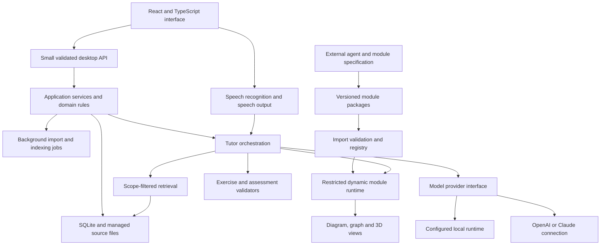

# Technical direction

## Desktop framework decision

**Provisional recommendation: Electron, React, and TypeScript for macOS and Windows.** Use a packaged prototype to validate PDF handling, local storage, background jobs, and installation on both platforms before treating the choice as final.

| Option | Relevant properties | Fit for this project |
| --- | --- | --- |
| Electron | Node.js main process, browser renderer, and background utility processes; TypeScript can be compiled for the application layers. | Leading option for keeping UI, domain rules, and orchestration in TypeScript. Its bundled runtime has a footprint that we must measure on the family's computers. [Process model](https://www.electronjs.org/docs/latest/tutorial/process-model) |
| Tauri 2 | Web frontend with a Rust core and operating-system webviews; avoids bundling the webview itself. | Strong alternative if package footprint is decisive and a Rust boundary is acceptable. Sharing TypeScript domain logic is possible, but backend placement and any additional runtime need deliberate design. [Process model](https://v2.tauri.app/concept/process-model/) |
| Browser application / PWA | A possible future distribution route for the same learning experience. | Defer while local books, desktop integration, and two desktop installers are the stated priorities. |

The recommendation is an engineering judgment about this project's TypeScript preference, not a benchmark result. Tauri supports TypeScript frontends; it should not be dismissed as incompatible with the requirement.

Propose Electron Forge for packaging and its documented React/TypeScript integration as a starting point. Select supported dependency versions during the prototype. Forge currently labels its Vite plugin experimental, so choose the documented TypeScript/Webpack route initially unless the prototype establishes a reason to accept that tooling tradeoff. [React with TypeScript](https://www.electronforge.io/guides/framework-integration/react-with-typescript), [Vite plugin status](https://www.electronforge.io/config/plugins/vite).

## Architecture

Keep one desktop application with clearly separated services and a restricted learning-module runtime. External frontier-model agents produce module packages in their own development environments; the desktop application imports and validates them. Embedded coding agents, a compiler, a hosted vector database and a multi-agent build service are not prerequisites for Aristotle.

OpenAI and Claude are the initial reasoning providers; the local route is a future extension. No route is implemented yet. They share the same scope checks and assessment rules, including in voice sessions.

Suggested application services (distinct from learning-module packages):

| Module | Responsibility |
| --- | --- |
| Desktop shell | Windows, file selection, operating-system integration, credential access |
| UI | Subject editing, reader, exam setup, study workspace, progress |
| Domain | Course and exam revisions, scope resolution, evidence rules, planner |
| Content | Parsers, source locations, import jobs, extraction review, indexes |
| Tutor | Bounded model requests, activity selection, prompts, response validation |
| Assessment | Deterministic checks, rubric evaluation, disputes and corrections |
| Rewards | Optional missions, versioned badge rules, idempotent awards and presentation preferences; consumes validated events without changing assessment or readiness |
| Module registry | Immutable packages, exact dependencies, source binding, activation and quarantine |
| Module runtime | Bounded generation/checking, schema-validated actions, public/private state separation |
| Visual host | Data tables, diagrams, graph and 3D renderers, accessible alternatives, semantic action bridge |
| Persistence | Database migrations, managed files, backup and restore |
| Providers | Local/cloud model adapters and capability descriptions |
| Voice | Microphone lifecycle, speech adapters, transcript correction, audio playback and interruption |

Keep the domain independent of React, Electron, and a particular model SDK. Use runtime schemas at process, model, and import boundaries; TypeScript types alone cannot validate external input.

## External authoring and module execution

The canonical handoff is in [modules/README.md](modules/README.md). A build request contains exported source bindings, desired content/dynamic packages, contracts and acceptance cases. External agents use their own frontier models and tools. Aristotle's responsibilities are export, import, validation, preview, activation and execution; it never trusts a passing report without checking its package identity and running applicable local validation.

Use a local module registry and a versioned Module SDK. The first SDK supplies deterministic generation helpers, exact-number/checker primitives, quantity/unit policies, bounded language normalisation, response parsing, mode rules, scene definitions and a conformance harness. Keep generated modules outside the Electron main process and privileged preload. Use a separate restricted view context and bounded computation environment with no ambient Node, filesystem, network or provider credentials. Prototype enforcement before enabling custom executable packages; workers alone do not establish isolation.

Content packages contain data. Dynamic packages contain prebuilt, inventoried code and assets; no build or install scripts run on import. Validate path safety, archive expansion limits, hashes, runtime schemas, capability requests and dependency digests. The host mediates all state and evidence changes. Private answer data stays outside student views, and failure or timeout yields unassessed rather than an incorrect mark.

Both generation and answer checking for installed deterministic families work offline from the first release. Future local LLM support is a separate capability. Pin source/module/checker versions and full activity snapshots so updates do not change a running question or historical assessment.

## Visual and assessment building blocks

Prefer structured scenes rendered by trusted host components for images, 2D diagrams, graphs and an initial 3D solid. Parameter changes update the same model used by the checker; graphics coordinates are translated into mathematical values through declared contracts. Custom views are allowed through an isolated, versioned message protocol when existing primitives cannot express the interaction.

Three.js is a candidate for 3D scene rendering; its scene/camera/renderer model fits the proposed solid visualisations. This is a library candidate, not a claim that its output is mathematically validated. [Three.js scene guide](https://threejs.org/manual/pages/creating-a-scene.html).

Start maths checking with small, explicit exact-arithmetic and linear-expression domains. A library such as math.js can help with parsing and computation, but its own documentation identifies expression-execution and resource-exhaustion risks. Restrict the grammar and allowed operations, cap complexity, and run calculations in a bounded environment. Do not use general JavaScript evaluation for student answers or claim arbitrary symbolic equivalence. [math.js security guide](https://mathjs.org/docs/expressions/security.html).

Keep renderer choices replaceable behind the scene contract. Prototype labelled SVG diagrams, coordinate graphs and a cuboid with keyboard/text alternatives on both platforms. A drawing library does not supply an assessment rubric or prove that a diagram agrees with its source. The [maths and visual specification](08-maths-tests-and-visual-learning.md) and [science/language contracts](10-science-and-language-modules.md) define that layer. Include a labelled native data table for science values; check tables, graphs and simulations against the same model state. Grammar/vocabulary checking uses reviewed finite structures and sense-specific rules. General scientific explanations and open writing use the host rubric path, not model calls from module code.

## Storage and retrieval

Propose SQLite for courses, exams, attempts, and job state, with local files for originals and derived assets. SQLite's FTS5 provides full-text search; use it as a retrieval baseline before deciding whether embeddings materially improve the representative queries. [SQLite FTS5](https://sqlite.org/fts5.html).

PDF.js is a candidate for the embedded PDF reader. Test its text and location handling against actual books; the existence of a PDF renderer does not establish reliable extraction of mathematical notation or diagrams. [PDF.js](https://mozilla.github.io/pdf.js/).

Retrieval should first narrow by course, immutable source version, active exam revision, objective, allowed ranges, and exclusions. Rank only eligible passages. Add adjacent context only within those boundaries. If semantic search is added, the same filters must apply before content is used, and embedding generation must follow the selected processing policy.

Track which passages informed an exercise or explanation. Check that every returned citation resolves and belongs to the permitted evidence set. Also evaluate whether it actually supports the claim; a valid page ID is not enough.

Avoid sending a whole book on each tutoring turn. Reuse extraction, approved objective mappings, exercise banks, and cached explanations. Cache keys must include source, exam, prompt, model, and policy versions where relevant so changed scope cannot reuse an invalid answer.

## AI mode and provider contract

The initial provider choices are OpenAI and Claude, using API keys and subscription-backed integrations where supported. Local models are planned for a later release. Evaluate exact models and connection routes without changing the domain model; see [AI connections and voice](06-ai-connections-and-voice.md) for authentication findings and release targets.

The reasoning-provider boundary should expose text generation, optional image input, optional embeddings, structured-result support, cancellation, and usage reporting. Speech recognition and speech output have separate adapters. Record capabilities explicitly: a text model must not receive a task that requires understanding an image or audio. Missing capabilities produce a clear limitation, not a silent provider switch.

| Situation | Expected behaviour |
| --- | --- |
| No AI configured | Library, reading, manual setup, reviewed exercises and installed deterministic generators/checkers remain usable |
| Cloud selected | Send only permitted content needed for the operation; make the destination and data categories visible |
| Local selected, in a future release | Use the configured local runtime; no cloud requests for inference, speech, OCR, embeddings, or evaluation without a separate explicit choice |
| Local model unavailable or too slow, in a future release | Offer existing material and resume/retry options; do not silently change providers |
| Offline | Reading, plans, saved exercises, installed dynamic generation/checking and local visuals continue; new AI-authored dialogue needs an available model, and local LLMs come later |
| Open-ended assessment unavailable | Save the response as unassessed for later evaluation or parent review |
| Voice service unavailable | Keep the transcript and text interface usable; explain which speech capability is unavailable |

“Stored locally” and “processed locally” are different claims. Initial model downloads and application updates also need to be distinguishable from sending study content off-device.

For cloud operations, the outbound payload may include retrieved passages, a selected page image, the question, the student's answer, and limited prior context. A cloud speech service may additionally receive microphone audio or reply text. Course-outline generation or cloud OCR can expose more material than a single tutor turn and needs its own clear setting. Avoid personal names and unrelated conversation history in model requests.

Provider retention, training use, age-related service conditions, cost, and deployment options require review for the selected integration. The dated provider-specific authentication findings are recorded in [AI connections and voice](06-ai-connections-and-voice.md).

## Bounded orchestration

Use an application-owned state machine: choose objective, resolve an active family and scope, retrieve evidence, generate an instance, validate, present, assess, and persist. The model proposes activities and explanations; installed modules generate/check their supported tasks; trusted host code decides allowed operations and commits state. An externally generated module version cannot be activated as an unreviewed side effect of a tutor turn.

Every request has a timeout, cancellation path, bounded retries, and a defined fallback. Parents can set an API budget, including speech costs; reserve a conservative estimated cost before requests and reconcile reported usage afterwards. Concurrent requests must not bypass the cap. Subscription quotas are tracked separately where reported and do not silently fall back to API billing. Local operations also need limits on runtime and resource usage.

Checkpoint imports and sessions. Give operations stable IDs so retries do not duplicate attempts, chargeable generation jobs, or source imports. A process crash must not lose already submitted answers.

## Desktop and data boundaries

For Electron, use isolated, sandboxed renderers, disable Node integration in the UI, restrict navigation, enforce a content security policy, and expose only narrowly defined IPC methods with input and sender validation. Imported source text and tutor responses are non-executable. Separately validated dynamic packages execute only through the restricted module host. [Electron security guidance](https://www.electronjs.org/docs/latest/tutorial/security).

Run expensive parsing and indexing away from the UI and keep filesystem access constrained to selected imports and managed storage. Moving a parser into a worker is a responsiveness measure, not by itself a security sandbox. The in-app tutor and module tools never receive arbitrary shell execution or unrestricted filesystem access. External builder tools operate outside Aristotle under their own explicitly configured environment.

Proposed household data controls:

- No Aristotle service account required for the initial single-computer setup; external AI connections use the parent's configured provider access.
- Separate student records, conversations, and study state; shared course material only where deliberately configured.
- Parent settings protected by an application lock. This prevents casual changes, not access by someone who controls the operating-system account.
- Provider credentials kept in the operating system's credential store, outside renderer code, logs, and exports.
- No content telemetry by default. Diagnostic exports are opt-in and redacted.
- Parent-selected backup destination and export contents; exclude credentials and show whether student responses and source files are included.
- Source and profile deletion removes associated cached content and indexes. External backups or provider-retained data have separate lifecycles and must not be represented as erased by a local delete.

Backup must capture a consistent database, referenced source files and the exact module packages needed for active sessions. Restore validates manifests, digests and schema versions before replacing an active library. Test restoring on both operating systems without relying on absolute file paths from the original computer or external builder.

## Platform delivery and performance

macOS and Windows are both first-release requirements. Confirm CPU architectures, available memory, operating-system versions, and Windows test access before selecting native dependencies or local models. A build that compiles on one platform is not evidence that the other installer works.

Prototype installation, PDF display, SQLite packaging, credential storage, backup restore, and offline launch on each platform. Decide signing, notarisation, and update distribution before the first household release; test database migration and rollback behaviour before automatic updates.

Keep the reader responsive during full-book import. Show progress and allow cancellation instead of waiting on an apparently frozen window. Set concrete performance budgets after measuring representative books and the family's computers; see the proposed validation targets in [delivery planning](05-delivery-and-open-decisions.md).
