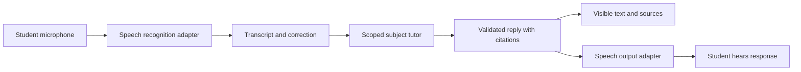

# AI connections and voice

## Confirmed direction

Aristotle will support OpenAI and Anthropic Claude, using API keys and subscription-backed access where the provider supports the integration. Local models are a future addition. Direct voice conversation with the active subject agent is a first-release requirement on macOS and Windows.

Separate four choices: the reasoning provider, the connection/authentication method, the speech recognition service, and the speech output service. They may use different providers and have different billing and data-handling rules.

These connections power Aristotle's in-app tutor and speech services. External frontier-model agents build modules using their own tools and provider access through the [module handoff](modules/README.md). They are not the subject tutor, and Aristotle does not need to expose a code-generation agent or its credentials to students. Installed module generators and deterministic checkers do not require model tokens for each question.

## Connection routes

The intended settings are “OpenAI,” “Claude,” and eventually “Local model.” Within a provider, offer the supported ways to connect. “Subscription tokens” should normally mean a supported sign-in and its managed credentials, not a generic field for pasting credentials from another application.

| Route | Proposed implementation direction | Status |
| --- | --- | --- |
| OpenAI API key | Direct API adapter with a parent-supplied key | Initial supported route |
| OpenAI subscription | Investigate the official Codex integration with managed ChatGPT sign-in | Desired initial route; validate suitability, entitlement, and runtime isolation |
| Claude API key | Direct Anthropic API adapter with a parent-supplied key | Initial supported route |
| Claude subscription | Use a provider-approved integration if available for Aristotle | Desired route; provider approval/availability is unresolved |
| Local model | Adapter to a configured local inference runtime | Future release; preserve the boundary now |

“Initial supported route” is a specification target, not an implemented connection. Both API adapters should be included in the first usable release; the parent chooses which to configure.

### What the official documentation establishes

Research snapshot: 28 September 2026. Recheck these integration surfaces before implementation and distribution.

- **OpenAI:** Codex documents ChatGPT sign-in for subscription access and API keys for usage-based access. Its app server is designed for integration into other products and exposes a managed sign-in flow; external-token authentication is experimental. This makes an official Codex adapter a candidate, not evidence that a ChatGPT token works as a general API key. [Authentication](https://learn.chatgpt.com/docs/auth), [Codex app server](https://learn.chatgpt.com/docs/app-server).
- **Anthropic:** the Agent SDK documentation says developers need prior approval to offer Claude account login or subscription limits in their products. Its general account guidance directs developers building products for others to API keys or supported cloud providers. Keep the Claude subscription route conditional on confirmed support for Aristotle. [Agent SDK overview](https://code.claude.com/docs/en/agent-sdk/overview), [Account and developer guidance](https://support.claude.com/en/articles/13189465-log-in-to-your-claude-account).
- **A qualification on Claude subscription usage:** a separate help article says a planned change to Agent SDK billing was paused and existing SDK/third-party usage still draws on subscription limits. That operational statement does not establish approval for a new third-party product. The documentation therefore does not support promising universal Claude subscription-token access. [Claude Agent SDK plan update](https://support.claude.com/en/articles/15036540-use-the-claude-agent-sdk-with-your-claude-plan).

The implementation should preserve the requested subscription capability without making unsupported access a dependency of the study experience. API-key support provides a documented integration route while provider-specific sign-in is validated.

## Authentication and runtime design

Represent a connection with provider, transport, authentication method, model, capabilities, account label, and status. Keep secret material behind an opaque credential reference. Suggested connection states are disconnected, connecting, ready, expired, quota-limited, and unavailable.

API keys are entered in parent settings and stored in the operating system's credential store. For supported subscription connections, prefer the provider's managed browser sign-in and token refresh. Do not scrape browser cookies or copy another application's authentication files. An official runtime should use isolated configuration, credentials, and conversation storage for Aristotle.

Connecting a reasoning provider does not automatically authorise another provider to process voice, images, or embeddings. Show the active route and any additional service needed for voice before enabling it. Allow disconnecting, switching, and testing a connection without exposing credentials to student profiles or logs.

If an official agent runtime is used for subscription access, it remains subordinate to Aristotle's scope and permission rules. Disable general shell, filesystem, browsing, inherited plugins, and ambient project instructions; expose only approved study operations. Verify that these restrictions are enforceable on both operating systems before selecting that adapter. A full coding-agent runtime is not interchangeable with a text completion client.

Use child profiles inside Aristotle and parent-managed provider configuration. Confirm the selected integration's account eligibility and rules for a child-facing application; do not assume that a parent's personal subscription automatically grants access to every child or API surface.

Keep subscription allowance, purchased credits, and API charges distinct. Display provider-reported limits when available, otherwise “availability unknown.” Running out of subscription usage must not silently activate billable API requests. Budget estimates include speech processing and any separate image/OCR requests.

## Voice conversation

The student opens a subject or exam and starts speaking to the same tutor they can message. Examples:

- “Can you explain why I need a common denominator?”
- “Quiz me on the particle model for tomorrow's test.”
- “Pregúntame sobre los verbos en pasado.”
- “Say that more slowly,” “Give me a hint,” or “Let me try again.”

Voice turns use the same course, exam revision, current exercise, conversation, and learning evidence as text turns. A voice session must not become an unscoped general conversation or a separate memory of the child.

Include the active module version and public scene revision in that shared state. Students can ask “show the balance,” “increase the gradient,” or “rotate the shape.” The tutor proposes a declared semantic action; the host checks the action, parameter range and mode before applying it. In a mock exam, voice cannot enable hints or reveal graph targets that the visual controls hide. “That point” needs a current selection or clarification.

### First-release interaction

1. Offer push-to-talk or click-to-start/stop a turn, with a visible microphone state and operating-system permission handling.
2. Display the recognised words and allow correction or re-recording. For ambiguous numbers, units, equations, or assessed language, confirm what was heard before recording a marked answer.
3. Respond aloud in the selected explanation language while showing the answer and source references on screen.
4. Let the student interrupt playback, repeat a reply, slow speech, mute audio, or continue by typing.
5. Stop microphone capture and playback when the session ends, the profile changes, or the device locks. No background listening or wake word in the initial release.

The tutor should speak in short turns and ask one question at a time. Keep full citations visually accessible instead of reading long URLs. Display mathematical notation while speaking it and clarify ambiguous spoken expressions.

Automatic turn detection and continuous conversation can improve this interaction after testing. The first usable voice workflow must already support multiple spoken turns; dictation alone is insufficient.

### Recommended first architecture

Start with a speech-to-text → existing subject tutor → text-to-speech pipeline. This preserves a common learning workflow for OpenAI and Claude and makes transcripts, corrections, and marking reviewable. OpenAI documents both chained voice interfaces and speech-to-speech approaches; assess realtime speech separately if the initial pipeline's latency is unsuitable. [OpenAI audio and voice guide](https://developers.openai.com/api/docs/guides/audio).

Speech adapters can be cloud services or verified operating-system capabilities initially; fully local model-based speech is a later option. Do not assume an operating-system speech service processes locally. Measure language availability and data routing on each platform. A Claude reasoning connection can use a separate speech adapter; do not assume that the reasoning connection itself supplies audio input/output.

Subscription-based reasoning also does not establish entitlement to transcription or speech APIs. Voice setup may require a separate API key or a supported operating-system speech route. This must be visible before the parent enables voice, with a working text fallback if speech is unavailable.

Treat the visual and spoken reply as two presentations of the same validated content. If speech requires a shorter wording, preserve its meaning and keep the full explanation visible. On interruption, cancel queued audio and discard stale responses from earlier turns; do not record unheard material as if the student had listened to it.

For interactive explanations, speak from the validated scene and calculation result. If the student changes the scene, cancel or revise narration bound to the old state. Do not send screenshots automatically when a compact public scene description is sufficient; private checker state and hidden answers are excluded until the host authorises a reveal.

## Voice and assessment

Spoken recall, explanations, and Spanish conversation practice are included. Transcription errors are not student errors. Record whether an answer was spoken, which transcript the student confirmed, and whether it was corrected before assessment. Changes after feedback count as assisted revision or a new attempt rather than silently replacing the original answer.

Do not use speech-to-text output as proof of correct pronunciation, spelling, or accent placement: recognition can normalise those features. Use typed responses for spelling assessment. Formal pronunciation scoring and exam-standard listening/oral assessment require their own future rubric, reference audio, and evaluation.

Microphone use should be visible and explicitly started. Do not retain raw student audio by default; discard transient buffers after the turn, retain only the transcript needed for study history, and make transcript deletion available. If a future feature needs recordings, specify its purpose, retention period, and parent control separately.

## Validation before release

Test two-way English and Spanish conversation on both platforms, including language changes, background noise, incorrect transcripts, numeric ambiguity, long pauses, interruption, denied permission, headset removal, network failure, and switching student profiles. Verify that raw audio is not retained by the application when recording retention is disabled.

Measure median and slow-case time from the end of the student's turn to first spoken reply, plus interruption delay. Select a usability target after trying the actual devices and providers; do not hide long waits behind repeated filler speech. Inspect each network destination so the displayed processing route matches what actually receives audio and transcripts.
