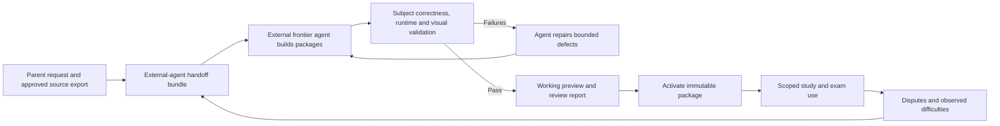

# Module system and agent authoring

## Product requirement

External agents using frontier models build new learning modules from a self-contained specification and the family's approved sources. Aristotle imports, validates, previews, and runs the resulting packages. It does not need an embedded coding agent, compiler, or autonomous module builder in the student application. A parent can prepare a request such as “Build a module for these chapters, with explanations and tests,” give the handoff bundle to an external agent, and import its result. Repeated practice must not require writing each question by hand.

The module system serves exam preparation: each activity teaches or assesses identified objectives, fits the selected exam, produces interpretable evidence, and suggests a useful next step. Merely loading a game, rendering a graph, or compiling generated code does not satisfy this requirement.

## Two module types

| Type | Contains | Does not own |
| --- | --- | --- |
| **Content module** | Curriculum context, units, objective definitions, prerequisites, source mappings, explanations, terminology, misconceptions, reviewed examples, rubrics, and static assets | Executable code, private student history, provider credentials, or the exam's final scope |
| **Dynamic module** | Activity families, parameter generators, response contracts, answer checkers, hints, interactive views, simulation rules, and validation fixtures | Unrestricted computer access, a separate student database, or authority to award itself mastery |

A content module can be useful by itself. A dynamic module depends on exact versions of one or more content modules and declares the objectives it implements. A course assembles these modules into the school's sequence; an exam selects a subset. Module boundaries should follow coherent learning units, not necessarily whole subjects or individual chapters.

For example, a linear-equations content module explains equality and inverse operations using the school book. Its dynamic module generates equations, checks solutions and supported working steps, and offers a balance diagram. A coordinate-graphs module can reuse the same graph renderer with different objectives and rules. Science modules generate unit-aware calculation/data tests and validated model explorations. Grammar modules generate reviewed sentence structures; vocabulary modules operate on sourced senses and contexts with separate recall and production evidence. These all use the same package/runtime boundary, with subject-specific validation.

Dynamic does not necessarily mean calling an LLM. A validated parameter generator can create and check new exercises locally without network access. The agent may choose the activity and explain its result, but the installed module supplies the executable behaviour.

## Three separate artifacts

1. **Module specification:** the input contract for the authoring agent: educational intent, source bindings, boundaries, interaction and assessment requirements, and acceptance examples.
2. **Module package:** the output: a manifest, content/assets, optional compiled dynamic code, runtime contracts, and pinned dependencies.
3. **Validation report:** evidence about that exact package digest: checks run, tested parameter space, known limitations, screenshots or scene captures, and educational review status.

These artifacts must remain separate. A promise in the specification is not a passing validation result. The package manifest identifies what can actually run; a content-only package cannot advertise a working question generator.

## Required authoring specification

The [external-agent handoff](modules/README.md) is the canonical entry point. It includes machine-readable build-request and package-manifest schemas, a TypeScript runtime contract, a reusable [request template](modules/module-specification-template.md), and worked requests for [maths](modules/examples/linear-equations.request.json), [science](modules/examples/density.request.json) and [English grammar/vocabulary](modules/examples/english-language.request.json). These define the proposed v1 contract; the actual Aristotle host, SDK tooling and import validator are not implemented yet.

| Field group | Required meaning |
| --- | --- |
| Identity | Stable module ID, type, proposed version, specification version, title, authoring provenance |
| Audience | Curriculum, level, language, prerequisites; no inferred GCSE board or year |
| Educational outcome | Observable objectives, success criteria, common misconceptions, explicit non-goals |
| Sources | Exact source-version/location bindings; authority and conflicts; unresolved bindings block activation |
| Dependencies | Exact content-module versions, objective IDs, supported SDK contract version |
| Content requirements | Explanations, examples, terminology, visual assets, citations, and teacher methods |
| Dynamic requirements | Activity families, parameter domains, constraints, difficulty dimensions, modes, deterministic seed behaviour |
| Assessment | Response types, correct/incorrect/partial/unassessed semantics, checkers, answer forms, units, method credit |
| Representation | Image/diagram, graph, 3D or simulation requirements; shared state; what the learner manipulates and predicts |
| Evidence | What constitutes an eligible attempt, help/reveal events, transfer checks, and what is only exploration |
| Accessibility | Keyboard alternative, readable text, nonvisual or 2D equivalent where educationally valid, reduced motion |
| Boundaries | Permitted host capabilities, no direct network/filesystem access, execution and asset limits |
| Acceptance | Worked input/output cases, misconception cases, edge cases, independent references, visual and student-flow checks |
| Completion | Required deliverables, unresolved limitations, validation gates, review and activation policy |

Natural-language authoring requests can be converted into this structured specification by an external agent or a parent-facing export flow. Missing educational decisions are surfaced; missing mathematical domains or marking rules cannot be silently invented and treated as teacher requirements. Agents can propose them with clear status.

## Authoring workflow

The authoring process should:

1. Resolve source bindings and map objectives; identify gaps before generating code.
2. Select suitable existing activity and visual primitives, or identify the need for a new dynamic component within the SDK.
3. Create content, generators, checkers, and views in the external agent's build workspace. The builder can author TypeScript; it is not limited to writing prompts or static question lists. The agent and its model access are chosen outside Aristotle.
4. Build with a controlled toolchain and pinned, allowlisted dependencies. Source text cannot install packages or choose arbitrary build commands.
5. Run contract, correctness, scope, capability, performance, accessibility, and rendering checks externally. Evaluate checkers against independently specified expected results, not just answers emitted by their paired generator. Supply reproducible fixtures and commands so the importer can rerun relevant checks; a builder's passing report is not trusted merely because it says “passed.”
6. Give failures back to the builder for a bounded repair cycle. Each revision gets a new digest and reruns affected checks. Preserve failure history instead of editing the report to look successful.
7. Produce importable packages, source code, reproducible build information, sample exercises, comparison with the requested outcomes, and an honest limitations report. Aristotle validates the imported artifacts and presents a preview.
8. Let the parent activate the first version after reviewing educational fit. Technical validation must already be complete; the parent is not expected to audit code or every random variant.

“Builder” and “verifier” are logical responsibilities; separate model agents are optional. Reusing one model is not independent mathematical verification. Use trusted checker primitives, independently authored fixtures, and external mathematical invariants where applicable.

The external build request sets a time, iteration, and spending budget. At a limit, the external agent returns the incomplete draft with specific failures. Aristotle continues using an existing valid activity. The tutor can record a missing capability for a later export; it cannot silently send source material or student records to an external authoring agent.

## Package and runtime contract

Packages contain a manifest with ID, immutable version, kind, SDK compatibility, exact dependency versions, objective bindings, asset inventory with provenance, exported activity/view/checker IDs, requested capabilities, and a content digest. Installation resolves all references and verifies artifacts before activation.

A dynamic SDK should offer these operations. The signatures are conceptual contracts, not application code already written:

| Operation | Inputs | Outputs and constraints |
| --- | --- | --- |
| `generate` | Allowed objectives/methods, difficulty constraints, mode, seed | Bounded question instance with public prompt/state and separate private assessment data; no learner identity needed |
| `validateInstance` | Full instance and resolved scope | Valid/invalid with reasons; mathematical domain, solvability, objective and source checks |
| `createView` | Public activity state, mode, supported visual capabilities | Declarative scene or isolated view; accessible alternative and allowed actions |
| `applyAction` | Public state and a validated semantic action | New bounded public state; no arbitrary script or DOM instructions |
| `check` | Frozen private instance, submitted response, submitted working | Criterion results, feedback codes, evidence and correct/partial/incorrect/unassessed outcome |
| `explain` | Validated result, content references, permitted reveal level | Explanation plan and visual actions; private answers released only under host policy |

Data crossing the boundary must be JSON-serializable and runtime-validated. The host owns IDs, timestamps, exam revision, student identity, attempt commits, and readiness calculations. A module can propose assessment evidence; it cannot write an arbitrary score directly into the student's record.

Use trusted host checkers and visual primitives where possible. New agent-authored algorithms and custom views are allowed only as versioned dynamic-package code that passes the same build and validation process. Modules never evaluate executable snippets received from a student or a tutoring response.

## Capabilities and isolation

Module code runs outside the privileged desktop shell. The first implementation must demonstrate that a module cannot read arbitrary files, call a model provider, access credentials, navigate to the internet, inspect another child's state, or mutate the application database. The only allowed interaction is a narrow, validated host protocol.

A browser worker or Node utility process alone is not the permission boundary. Prototype an isolated renderer/origin for views and a restricted execution environment for generators/checkers, with enforced network restrictions and no Node or general desktop bridge. Enforce message schemas, frame identity, scoped asset IDs, CPU/memory/time limits, and termination of runaway work. If the chosen implementation cannot enforce these boundaries, custom executable modules remain unavailable; validated declarative modules can still run through trusted host primitives.

Authoring happens outside the application using the external agent's own tools and credentials. The handoff contains only deliberately exported sources and requirements, with synthetic student cases by default. Aristotle credentials and private learning histories are excluded. A new dependency or host capability requires an explicit application-level review; ordinary module variants do not require editing Aristotle itself. The importer never runs arbitrary supplied install scripts or a builder's shell commands.

## States, updates, and portability

Module states are draft, building, validation-failed, validated, active, quarantined, and archived. Only active versions can supply ordinary study tasks; previews are marked and contribute no learning evidence. Content and dynamic dependencies activate atomically after all required checks pass.

Pin module versions, dependency versions, checker versions, resolved parameters, and instance data to each attempt. Store the rendered prompt and relevant scene state as well as the seed; a seed is insufficient when a library or algorithm changes. Mid-session updates cannot rewrite the question being answered.

A reported defect can quarantine an activity family or whole version, preserving attempts for review and switching future sessions to a known valid version. Correcting the checker produces versioned reassessments and recalculated evidence. Do not automatically carry a “validated” label to a changed package.

Export module definitions and assets separately from student records. Bundled source excerpts retain their provenance and distribution permissions; module export can omit the original book and require source rebinding on import. Missing, changed, or deleted sources invalidate affected bindings and derived assets rather than leaving copied passages hidden in packages. Historical package identity may remain without retaining deleted content. Backups include active versions needed to resume existing sessions.

## What proves the framework works

The first module milestone is complete only when an agent can take the supplied module specification, produce a new content/dynamic pair, generate fresh checked questions, show a functioning visual explanation, and run the complete attempt-feedback-review loop without a developer hand-writing each item. Graph/3D modules and a bounded dynamic science module must demonstrate that the framework extends beyond a single exercise type or subject. The proposed grammar/vocabulary pair tests linguistic constraints and finite-bank handling through the same handoff. The [maths design](08-maths-tests-and-visual-learning.md) and [science/language design](10-science-and-language-modules.md) provide reference behaviours. Science is a core requirement; the exact starter language families remain proposals to match against school materials.
